# SAGE Architecture Documentation

<div align="center">

# System Architecture & Flow

**Understanding the Multi-Agent Orchestration System**

</div>

---

## Table of Contents

1. [System Overview](#system-overview)
2. [Architecture Diagram](#architecture-diagram)
3. [Component Details](#component-details)
4. [Data Flow](#data-flow)
5. [State Management](#state-management)
6. [Agent Workflows](#agent-workflows)

---

## System Overview

SAGE is built on a **multi-agent architecture** using LangGraph, where specialized AI agents collaborate to provide comprehensive academic support. The system uses the **ReACT (Reasoning and Acting)** framework for structured decision-making.

### Design Principles

| Principle | Description |
|-----------|-------------|
| **Modularity** | Each agent is independent and focused on a specific domain |
| **Parallelism** | Compatible agents execute concurrently for efficiency |
| **State-Driven** | Centralized state management ensures data consistency |
| **Context-Aware** | Conversation history enables coherent multi-turn interactions |

---

## Architecture Diagram

### High-Level System Architecture

```mermaid
%%{init: {'theme': 'base', 'themeVariables': { 'primaryColor': '#4F46E5', 'primaryTextColor': '#fff', 'primaryBorderColor': '#3730A3', 'lineColor': '#6366F1', 'secondaryColor': '#EC4899', 'tertiaryColor': '#10B981', 'background': '#F8FAFC'}}}%%

flowchart TB
    subgraph UI["🖥️ USER INTERFACE"]
        style UI fill:#E0E7FF,stroke:#4F46E5,stroke-width:2px
        A[("👤 User Input")] --> B["💬 Streamlit Chat Interface"]
        B --> C["📝 Conversation History"]
    end

    subgraph CORE["⚙️ CORE ORCHESTRATION"]
        style CORE fill:#FCE7F3,stroke:#EC4899,stroke-width:2px
        D["🎯 Coordinator Agent"]
        E["👤 Profile Analyzer"]
        F["🔀 Router"]
    end

    subgraph AGENTS["🤖 SPECIALIZED AGENTS"]
        style AGENTS fill:#D1FAE5,stroke:#10B981,stroke-width:2px
        G["📅 Planner Agent"]
        H["📝 NoteWriter Agent"]
        I["🎓 Advisor Agent"]
    end

    subgraph EXECUTION["⚡ EXECUTION LAYER"]
        style EXECUTION fill:#FEF3C7,stroke:#F59E0B,stroke-width:2px
        J["🔄 Agent Executor"]
        K["📊 Results Aggregator"]
    end

    subgraph DATA["💾 DATA LAYER"]
        style DATA fill:#E0F2FE,stroke:#0EA5E9,stroke-width:2px
        L[("📋 Student Profile")]
        M[("📆 Calendar Data")]
        N[("✅ Tasks Data")]
    end

    subgraph LLM["🧠 LLM BACKEND"]
        style LLM fill:#FEE2E2,stroke:#EF4444,stroke-width:2px
        O["✨ Google Gemini API"]
    end

    C --> D
    D --> E
    E --> F
    F --> G & H & I
    G & H & I --> J
    J --> K
    K --> B

    L & M & N --> D
    O <--> D & E & G & H & I
```



### Detailed Workflow Flow

```mermaid
%%{init: {'theme': 'base', 'themeVariables': { 'primaryColor': '#7C3AED', 'primaryTextColor': '#fff', 'lineColor': '#8B5CF6', 'secondaryColor': '#F472B6', 'tertiaryColor': '#34D399'}}}%%

flowchart LR
    subgraph INPUT["📥 INPUT PHASE"]
        style INPUT fill:#EDE9FE,stroke:#7C3AED,stroke-width:2px
        A["User Message"] --> B["Build Context"]
        B --> C["Load History"]
    end

    subgraph COORD["🎯 COORDINATION PHASE"]
        style COORD fill:#FCE7F3,stroke:#EC4899,stroke-width:2px
        D["Coordinator\nAnalysis"] --> E["Agent\nSelection"]
        E --> F["Priority\nAssignment"]
    end

    subgraph PROFILE["👤 PROFILE PHASE"]
        style PROFILE fill:#CFFAFE,stroke:#06B6D4,stroke-width:2px
        G["Extract\nLearning Style"] --> H["Analyze\nPreferences"]
    end

    subgraph PARALLEL["⚡ PARALLEL EXECUTION"]
        style PARALLEL fill:#D1FAE5,stroke:#10B981,stroke-width:2px
        I["🗓️ Planner\nWorkflow"]
        J["📝 NoteWriter\nWorkflow"]
        K["🎓 Advisor\nWorkflow"]
    end

    subgraph OUTPUT["📤 OUTPUT PHASE"]
        style OUTPUT fill:#FEF3C7,stroke:#F59E0B,stroke-width:2px
        L["Aggregate\nResults"] --> M["Format\nResponse"]
        M --> N["Display to\nUser"]
    end

    C --> D
    F --> G
    H --> I & J & K
    I & J & K --> L
```



---

## Component Details

### 1. User Interface Layer

```
┌─────────────────────────────────────────────────────────────┐
│                    STREAMLIT APPLICATION                     │
│  ┌─────────────────┐  ┌──────────────────────────────────┐  │
│  │    SIDEBAR      │  │         MAIN CHAT AREA           │  │
│  │                 │  │                                  │  │
│  │  💡 Try These   │  │  💬 Chat with SAGE               │  │
│  │  ─────────────  │  │  ──────────────────              │  │
│  │  • Calculus     │  │                                  │  │
│  │  • Schedule     │  │  👤 User: Create a schedule...   │  │
│  │  • Deadlines    │  │                                  │  │
│  │  • Notes        │  │  🤖 SAGE: Here's your plan...    │  │
│  │                 │  │                                  │  │
│  │  ─────────────  │  │  ┌────────────────────────────┐  │  │
│  │  🗑️ Clear Chat  │  │  │  Enter your request...     │  │  │
│  └─────────────────┘  │  └────────────────────────────┘  │  │
└─────────────────────────────────────────────────────────────┘
```

| Component | File | Description |
|-----------|------|-------------|
| **Chat Interface** | `app.py` | Streamlit-based web UI for user interactions |
| **Message History** | `app.py` | Stores conversation for context awareness |
| **Session State** | `app.py` | Manages user session data |

---

### 2. Coordinator Agent

```mermaid
%%{init: {'theme': 'base', 'themeVariables': { 'primaryColor': '#DC2626', 'primaryTextColor': '#fff', 'lineColor': '#EF4444'}}}%%

flowchart TD
    subgraph COORDINATOR["🎯 COORDINATOR AGENT"]
        style COORDINATOR fill:#FEE2E2,stroke:#DC2626,stroke-width:2px

        A["📨 Receive Request"] --> B["🔍 Analyze Context"]
        B --> C{"🤔 ReACT\nReasoning"}

        C --> D["💭 Thought:\nAnalyze complexity"]
        D --> E["⚡ Action:\nSelect agents"]
        E --> F["👁️ Observation:\nEvaluate capabilities"]
        F --> G["✅ Decision:\nDeployment plan"]

        G --> H["📋 Output:\n• required_agents\n• priority\n• concurrent_groups"]
    end
```



**File:** `src/agents/coordinator.py`

**Responsibilities:**
- Analyzes user requests to determine complexity and scope
- Routes requests to appropriate specialized agents
- Manages parallel execution groups
- Considers conversation history for context

**Output Structure:**
```python
{
    "required_agents": ["PLANNER", "ADVISOR"],
    "priority": {"PLANNER": 1, "ADVISOR": 2},
    "concurrent_groups": [["PLANNER", "ADVISOR"]],
    "reasoning": "Analysis details..."
}
```

---

### 3. Profile Analyzer

```mermaid
%%{init: {'theme': 'base', 'themeVariables': { 'primaryColor': '#0891B2', 'primaryTextColor': '#fff', 'lineColor': '#06B6D4'}}}%%

flowchart LR
    subgraph PROFILE["👤 PROFILE ANALYZER"]
        style PROFILE fill:#CFFAFE,stroke:#0891B2,stroke-width:2px

        A["📊 Student\nProfile"] --> B["🎨 Learning\nStyle"]
        A --> C["⏰ Energy\nPatterns"]
        A --> D["🧠 Executive\nFunction"]
        A --> E["🌍 Environment\nPreferences"]

        B & C & D & E --> F["📝 Profile\nAnalysis"]
    end
```



**File:** `src/agents/coordinator.py`

**Analysis Areas:**

| Area | What It Analyzes |
|------|-----------------|
| **Learning Characteristics** | Visual/auditory/kinesthetic preferences, attention span |
| **Environmental Factors** | Optimal study environment, distraction triggers |
| **Executive Function** | Task management patterns, focus duration |
| **Energy Management** | Peak energy periods, recovery needs |

---

### 4. Planner Agent

```mermaid
%%{init: {'theme': 'base', 'themeVariables': { 'primaryColor': '#059669', 'primaryTextColor': '#fff', 'lineColor': '#10B981'}}}%%

flowchart TD
    subgraph PLANNER["📅 PLANNER AGENT"]
        style PLANNER fill:#D1FAE5,stroke:#059669,stroke-width:2px

        A["📆 Calendar\nAnalyzer"] --> B["✅ Task\nAnalyzer"]
        B --> C["📋 Plan\nGenerator"]

        subgraph ANALYSIS["Analysis Phase"]
            style ANALYSIS fill:#A7F3D0,stroke:#059669
            D["• Time blocks\n• Conflicts\n• Energy patterns"]
            E["• Priorities\n• Deadlines\n• Dependencies"]
        end

        subgraph OUTPUT["Output Phase"]
            style OUTPUT fill:#6EE7B7,stroke:#059669
            F["• Weekly schedule\n• Study sprints\n• Break management\n• Emergency protocols"]
        end

        A --> D
        B --> E
        D & E --> C
        C --> F
    end
```



**File:** `src/agents/planner.py`

**Sub-components:**

| Component | Function |
|-----------|----------|
| `calendar_analyzer` | Analyzes calendar events, finds available time slots |
| `task_analyzer` | Evaluates tasks by priority, complexity, deadlines |
| `plan_generator` | Creates comprehensive study plans using ReACT framework |

**Features:**
- ADHD-friendly scheduling with frequent breaks
- Energy-optimized time blocking
- Emergency protocols and backup strategies
- Environment switching recommendations

---

### 5. NoteWriter Agent

```mermaid
%%{init: {'theme': 'base', 'themeVariables': { 'primaryColor': '#7C3AED', 'primaryTextColor': '#fff', 'lineColor': '#8B5CF6'}}}%%

flowchart TD
    subgraph NOTEWRITER["📝 NOTEWRITER AGENT"]
        style NOTEWRITER fill:#EDE9FE,stroke:#7C3AED,stroke-width:2px

        A["🎨 Analyze\nLearning Style"] --> B["📚 Generate\nNotes"]

        subgraph STYLE["Style Adaptation"]
            style STYLE fill:#DDD6FE,stroke:#7C3AED
            C["Visual → Diagrams"]
            D["Auditory → Summaries"]
            E["Kinesthetic → Examples"]
        end

        subgraph NOTES["Note Generation"]
            style NOTES fill:#C4B5FD,stroke:#7C3AED
            F["• Key concepts (80/20)\n• Visual aids\n• Quick reference\n• Emergency tips"]
        end

        A --> C & D & E
        C & D & E --> B
        B --> F
    end
```



**File:** `src/agents/notewriter.py`

**Features:**
- Adapts to student's learning style
- Uses 80/20 principle for essential concepts
- Creates time-optimized study materials
- Includes emergency tips and quick references

---

### 6. Advisor Agent

```mermaid
%%{init: {'theme': 'base', 'themeVariables': { 'primaryColor': '#DB2777', 'primaryTextColor': '#fff', 'lineColor': '#EC4899'}}}%%

flowchart TD
    subgraph ADVISOR["🎓 ADVISOR AGENT"]
        style ADVISOR fill:#FCE7F3,stroke:#DB2777,stroke-width:2px

        A["🔍 Analyze\nSituation"] --> B["💡 Generate\nGuidance"]

        subgraph ANALYSIS["Situation Analysis"]
            style ANALYSIS fill:#FBCFE8,stroke:#DB2777
            C["• Current challenges\n• Stress levels\n• Time constraints\n• Learning compatibility"]
        end

        subgraph GUIDANCE["Guidance Output"]
            style GUIDANCE fill:#F9A8D4,stroke:#DB2777
            D["1. Immediate Actions\n2. Schedule Optimization\n3. Energy Management\n4. Support Strategies\n5. Emergency Protocols"]
        end

        A --> C
        C --> B
        B --> D
    end
```



**File:** `src/agents/advisor.py`

**Guidance Areas:**
- Immediate actionable steps
- Schedule optimization strategies
- Stress and energy management
- Support resources and strategies
- Contingency planning

---

### 7. Agent Executor

```mermaid
%%{init: {'theme': 'base', 'themeVariables': { 'primaryColor': '#EA580C', 'primaryTextColor': '#fff', 'lineColor': '#F97316'}}}%%

flowchart LR
    subgraph EXECUTOR["⚡ AGENT EXECUTOR"]
        style EXECUTOR fill:#FED7AA,stroke:#EA580C,stroke-width:2px

        A["📋 Concurrent\nGroups"] --> B["🔄 Parallel\nExecution"]
        B --> C["📊 Result\nAggregation"]
        C --> D["🛡️ Error\nHandling"]
        D --> E["📤 Final\nOutput"]
    end
```



**File:** `src/executor/agent_executor.py`

**Responsibilities:**
- Manages concurrent execution of agent groups
- Handles async task gathering
- Aggregates results from multiple agents
- Provides fallback mechanisms for errors

---

## Data Flow

### Complete Request Flow

```mermaid
%%{init: {'theme': 'base', 'themeVariables': { 'primaryColor': '#2563EB', 'secondaryColor': '#7C3AED', 'tertiaryColor': '#059669'}}}%%

sequenceDiagram
    autonumber
    participant U as 👤 User
    participant S as 💻 Streamlit
    participant C as 🎯 Coordinator
    participant P as 👤 Profile Analyzer
    participant R as 🔀 Router
    participant A as 🤖 Agents
    participant E as ⚡ Executor
    participant G as ✨ Gemini

    U->>S: Enter request
    S->>S: Build conversation history
    S->>C: Send state with history

    C->>G: Analyze request
    G-->>C: Routing decision
    C->>P: Pass to profile analyzer

    P->>G: Analyze student profile
    G-->>P: Learning preferences
    P->>R: Route to agents

    R->>A: Activate selected agents

    par Parallel Execution
        A->>G: Planner request
        G-->>A: Schedule plan
    and
        A->>G: NoteWriter request
        G-->>A: Study notes
    and
        A->>G: Advisor request
        G-->>A: Guidance
    end

    A->>E: Agent outputs
    E->>E: Aggregate results
    E->>S: Final response
    S->>U: Display results
```



---

## State Management

### Academic State Structure


**File:** `src/state/academic_state.py`

**State Reducers:**

The system uses custom reducers to merge state updates:

```python
# Dict reducer merges nested dictionaries recursively
def dict_reducer(dict1, dict2):
    # Merges dict2 into dict1 recursively
    # Preserves existing keys while adding new ones
```

---

## Agent Workflows

### LangGraph Workflow Definition


**File:** `src/graph.py`

**Key Functions:**

| Function | Purpose |
|----------|---------|
| `create_agents_graph()` | Builds the complete workflow graph |
| `route_to_parallel_agents()` | Determines which agents to activate |
| Conditional edges | Enable dynamic routing based on state |

---

## Technology Stack

```
┌────────────────────────────────────────────────────────────┐
│                    PRESENTATION LAYER                       │
│                      Streamlit 1.28+                        │
├────────────────────────────────────────────────────────────┤
│                   ORCHESTRATION LAYER                       │
│              LangGraph + LangChain Core                     │
├────────────────────────────────────────────────────────────┤
│                      AGENT LAYER                            │
│     Coordinator │ Planner │ NoteWriter │ Advisor           │
├────────────────────────────────────────────────────────────┤
│                       LLM LAYER                             │
│                 Google Gemini 1.5 Flash                     │
├────────────────────────────────────────────────────────────┤
│                      DATA LAYER                             │
│          JSON Files │ Session State │ Pydantic             │
└────────────────────────────────────────────────────────────┘
```

---

## Key Files Reference

| File | Purpose |
|------|---------|
| `app.py` | Main Streamlit application |
| `src/graph.py` | LangGraph workflow definition |
| `src/agents/coordinator.py` | Request routing and orchestration |
| `src/agents/planner.py` | Schedule and time management |
| `src/agents/notewriter.py` | Study material generation |
| `src/agents/advisor.py` | Academic guidance |
| `src/agents/prompts.py` | All prompt templates |
| `src/executor/agent_executor.py` | Parallel execution handler |
| `src/state/academic_state.py` | State type definitions |
| `src/llm/gemini_llm.py` | Gemini API wrapper |

---

<div align="center">

**Built with LangGraph for intelligent multi-agent orchestration**

</div>
